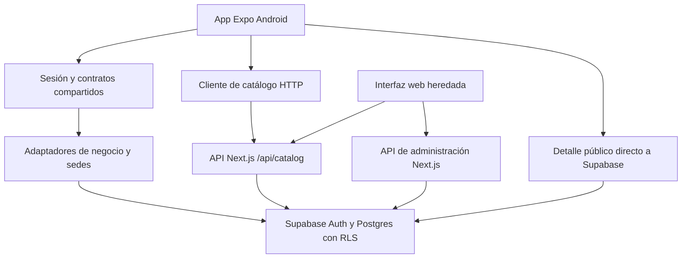

# AntojosGo: análisis integral del proyecto

Fecha de corte: **2 de octubre de 2026**. Documento de diagnóstico y planificación basado en el repositorio, pruebas ejecutadas y consultas de solo lectura a Supabase. No representa una certificación de producción.

## 1. Conclusión del estado actual

AntojosGo tiene una base móvil nativa en Expo, autenticación con Supabase, administración inicial de negocios y sedes, y selección de coordenadas. No es todavía un MVP completo ni una aplicación lista para distribución nacional. El área más avanzada es la administración básica del restaurante; el recorrido público del comensal permanece incompleto.

Los bloqueos principales son concretos:

1. El arranque Android fue reportado nuevamente como fallido por el usuario. Los registros anteriores de ejecución de JavaScript no certifican que la pantalla y el recorrido funcionen hoy.
2. La base remota contiene dos sedes, ambas en borrador, y no tiene políticas públicas de lectura para restaurantes/sedes.
3. El backend de menú espera columnas que no existen en la tabla remota `foods`; además, el rol autenticado solo tiene permiso de lectura en esa tabla.
4. La subida de imágenes existente es un prototipo: guarda una URL de placeholder, no el archivo recibido.
5. La búsqueda pública obtiene como máximo 200 sedes y después filtra en JavaScript. Puede omitir coincidencias y no constituye una solución nacional.
6. La documentación contiene decisiones antiguas contradictorias: Firebase frente a Supabase Auth, Capacitor frente a Expo y SQL pendiente presentado en algunos documentos como listo para aplicar.

No corresponde asignar un porcentaje global de avance: mezclar pantallas, backend, permisos, pruebas y operaciones daría una cifra engañosa. Este informe utiliza estados por capacidad y condiciones verificables de cierre.

## 2. Alcance y calidad de la evidencia

### 2.1 Estados utilizados

| Estado | Significado |
|---|---|
| Implementado | Existe código que realiza la operación; no garantiza un recorrido completo real |
| Verificado hoy | Hay una prueba o consulta ejecutada el 2 de octubre |
| Verificación histórica | Se documentó una comprobación en sesiones anteriores; no se repitió hoy |
| Parcial | Existe una parte de la función, pero faltan conexiones, datos o validaciones |
| Bloqueado | Hay evidencia concreta que impide completar el recorrido |
| Pendiente | No se encontró implementación completa en el camino móvil revisado |
| Riesgo por verificar | El código sugiere un problema; falta reproducirlo en su entorno efectivo |

### 2.2 Trabajo realizado para este informe

- Lectura de especificación, planes, arquitectura, contratos y documentación de Android, sedes, menú y catálogo.
- Inspección de rutas Expo, sesión, cliente Supabase, catálogo, componentes móviles y script de arranque.
- Revisión de adaptadores de negocio, servidor de menú, autorización y ruta de imágenes.
- Ejecución de `npm.cmd test`, `npm.cmd run mobile:typecheck` y `npm.cmd run typecheck`.
- Consultas de solo lectura a Supabase: políticas de cuatro tablas principales, RLS, permisos de `foods`, columnas de menú, estados de sedes y existencia de PostGIS.
- Revisión del error conservado en `mobile/.expo/server-error.log`.

No se modificaron datos remotos, no se crearon usuarios y no se aplicaron migraciones para elaborar el informe. No se reprodujo hoy el recorrido visual Android, ni se ejecutó una auditoría exhaustiva de seguridad, una prueba de carga, restauración de respaldo o compilación APK.

### 2.3 Resultados de pruebas actuales

| Comprobación | Resultado | Interpretación |
|---|---|---|
| `npm.cmd test` | 24 aprobadas, 0 fallidas | Contratos, transporte, errores y adaptadores cubiertos por la suite |
| Tipos móviles | Aprobado | TypeScript no detecta errores en el alcance configurado |
| Tipos raíz | Aprobado | TypeScript no detecta errores en el alcance configurado |
| Esquema/políticas remotas | Consultados | Confirman bloqueos de menú y publicación |
| Prueba visual Android | No realizada hoy | Arranque y navegación siguen sin certificación actual |
| Build web y exportación Android | Aprobaciones históricas del 28 de septiembre | No equivalen a APK ni se repitieron para este informe |
| Smoke HTTP | 6 aprobaciones históricas | No se repitieron hoy |

La primera ejecución aislada produjo `EPERM` al leer dependencias de `node_modules`. La repetición autorizada fuera del entorno aislado pasó. Esos errores de permisos no son evidencia de una regresión funcional de la app.

Los tests llamados `auth-integration` utilizan el SDK real con un transporte simulado y dominio de prueba. Verifican integración con el SDK, **no** un registro real en el proyecto remoto ni persistencia en SecureStore del emulador.

## 3. Objetivos vigentes y decisiones

### 3.1 Producto

El objetivo específico del MVP es ayudar a decidir dónde comer, usando únicamente restaurantes registrados en AntojosGo. El punto de partida es Xela, con datos preparados para otros municipios y departamentos de Guatemala. La aspiración nacional no significa cobertura existente ni capacidad de concurrencia demostrada.

El restaurante administra su negocio, sedes, ubicación, horarios, menú, fotos y posteriormente integrantes y reseñas. El comensal busca, consulta opciones, filtra, guarda favoritos y recibe recomendaciones justificadas por datos reales.

La intención multiservicios se conserva como criterio de modularidad y evolución. La especificación actual excluye pedidos, reservas y delivery del MVP; no conviene abrir esos módulos antes de cerrar restaurantes y descubrimiento.

### 3.2 Decisiones que deben prevalecer

| Tema | Decisión vigente / implementación | Diferencia pendiente |
|---|---|---|
| Cliente principal | Android con Expo + React Native | Certificar recorrido y construir APK independiente |
| Identidad | Supabase Auth por decisión posterior del usuario | Corregir referencias antiguas a migración obligatoria a Firebase |
| Datos | PostgreSQL en Supabase | Migraciones y permisos deben concordar con el código |
| Backend | Next.js conserva API actual | Express es objetivo preferido, no servidor ya implementado |
| Mapas móviles | `react-native-maps` | Mapbox quedó como preferencia histórica; producción necesita configuración del proveedor elegido |
| Imágenes | Cloudinary propuesto | No existe carga real certificada |
| IA | Mejora opcional | Búsqueda convencional debe funcionar primero |
| Correos en pruebas | Confirmación desactivada históricamente por el usuario | No se reconsultó configuración Auth hoy; producción requiere decidir verificación y recuperación |

Fuentes: [especificación](PRODUCT-SPEC.md), [plan](EXECUTION-PLAN.md), [sedes](BRANCHES.md) y decisiones posteriores de la conversación. Las anotaciones antiguas de los documentos no deben interpretarse como cambios de decisión nuevos.

## 4. Arquitectura real



### 4.1 Carpetas y responsabilidades

| Carpeta | Responsabilidad actual |
|---|---|
| `mobile/app` | Rutas Expo: acceso, inicio, restaurantes, negocio, ubicación, búsqueda y detalle |
| `mobile/src` | Sesión, UI nativa, GPS, cliente HTTP y listado de sedes |
| `shared/contracts` | Validación y contratos de cuentas, negocios, sedes y búsquedas |
| `modules/accounts/data` | Perfil personal |
| `modules/restaurants/data` | Persistencia de negocios y sedes |
| `modules/catalog/data` | Proyección y búsqueda de sedes publicadas |
| `app/api` | Endpoints Next.js de catálogo y administración |
| `lib/server` | Operaciones de servidor y autorización |
| `components` | Interfaz web y componentes heredados; no son automáticamente funciones móviles |
| `scripts` | SQL, verificaciones y herramientas de arranque |
| `tests` | Pruebas locales y scripts SQL de aislamiento |
| `android` | Proyecto Capacitor histórico, distinto del cliente Expo |

### 4.2 Separación frontend/backend

Ya hay separación de responsabilidades, pero no una migración completa a servicios independientes. La app accede directamente a Supabase para identidad, negocio y sedes; el catálogo de listado utiliza Next.js y el detalle vuelve a consultar Supabase directamente.

Esto permite reutilizar código y avanzar, pero genera dos caminos de lectura pública con permisos y errores que pueden diferir. Conviene definir una única API pública para listado y detalle. Extraer Express solo debe hacerse con contratos y pruebas preservados; por sí solo no resuelve permisos, consultas lentas o datos incompletos.

### 4.3 Dependencias declaradas

El cliente declara Expo 57.0.25, React Native 0.86.3, React 19.2.3, expo-router 57.0.23, react-native-maps 1.27.2, Supabase JS 2.117.2 y TypeScript 6.0.3. El servidor/web conserva Next 15.2.4 y un entorno TypeScript separado. Son versiones leídas del proyecto, no una afirmación de que todas sean las últimas disponibles hoy.

El lockfile móvil permite reproducir instalaciones. En la raíz permanecen rangos y `bcryptjs: latest`; normalizar versiones y elegir un procedimiento de instalación reduce variaciones. No actualizar todos los paquetes de forma indiscriminada: verificar compatibilidad, cambios de comportamiento y pruebas por cada grupo.

## 5. Inventario funcional

| Capacidad | Estado real | Evidencia / límite |
|---|---|---|
| Registro con nombre, correo y contraseña | Implementado, comprobaciones históricas | `mobile/app/index.tsx`; no repetido visualmente hoy |
| Inicio y cierre de sesión | Implementado | Supabase Auth; tests SDK con transporte simulado |
| Persistencia de sesión móvil | Implementada | SecureStore; falta prueba de cierre forzado y reapertura actual |
| Renovación al volver al primer plano | Implementada | Listener de AppState y auto-refresh |
| Selección comensal/restaurante | Implementada | Pantalla `home`; es navegación, no autorización de roles |
| Crear/listar negocios propios | Implementado | Adaptadores con propiedad y prevención de duplicado por nombre |
| Editar nombre/descripción | Implementado | Contrato compartido y consulta por propietario |
| Crear/listar sedes | Implementado, verificación histórica | ID estable y páginas de 20 |
| Guardar punto exacto en mapa | Implementado, pendiente certificación visual | Editor nativo y coordenadas emparejadas |
| Editar todos los datos de una sede | Parcial | No confundir edición de ubicación con perfil completo |
| Buscar por nombre o municipio | Implementado parcialmente | Depende de API y acceso público aún incompleto |
| GPS opcional | Implementado | Permiso explícito y espera limitada |
| Listado/mapa de sedes publicadas | Bloqueado como recorrido útil | No hay sedes publicadas; políticas públicas ausentes |
| Detalle público | Pantalla básica implementada | Consulta directa; no muestra menú ni horarios completos |
| Menú del propietario | Backend parcial y bloqueado | Esquema remoto incompatible, sin escritura autorizada |
| Fotos reales | Pendiente | Ruta existente utiliza placeholder |
| Horarios por sede | Pendiente en recorrido móvil | Requiere modelo y edición |
| Miembros y roles | Pendiente en recorrido móvil | Propietario único no equivale a equipo de trabajo |
| Favoritos sincronizados | Pendiente móvil | Favoritos web con localStorage no resuelven sincronización |
| Exclusiones y Sorpréndeme | Pendiente de circuito real | Deben operar sobre resultados válidos |
| Reseñas y respuestas | No certificadas en móvil | Scripts/componentes heredados no prueban un flujo funcional |
| Voz e interpretación IA | Pendiente de integración real | No necesarias para cerrar búsqueda convencional |
| APK independiente y distribución | Pendiente | Exportar Hermes no produce APK |

## 6. Cómo funcionan los recorridos actuales

### 6.1 Identidad

La pantalla valida datos con los esquemas compartidos. El registro envía correo y contraseña a Supabase Auth y el nombre como metadato de presentación. El login utiliza `signInWithPassword`. La sesión se guarda con SecureStore y `SessionProvider` escucha los cambios.

La contraseña no debe guardarse en tablas de negocio ni duplicarse en un sistema propio. La gestión de credenciales corresponde a Auth. El nombre editable no otorga propiedad ni privilegios. La autorización debe seguir dependiendo de la identidad verificada y las políticas de acceso.

Hay prevención de doble envío y mensajes de errores del proveedor. Faltan recuperación móvil de contraseña, enlaces de retorno verificados y certificación de los escenarios de expiración, revocación y reinstalación.

### 6.2 Negocio y sede

Un usuario puede poseer varios negocios. `restaurants.auth_owner_id` vincula la identidad al negocio. `restaurant_branches.restaurant_id` vincula sedes al negocio; dirección y coordenadas pertenecen a la sede.

Crear negocio usa una operación que ignora duplicados por propietario y nombre, seguida de lectura. Crear sede utiliza un identificador estable para reintentos. El listado de negocios tiene límite de 50 sin un mecanismo visible de continuación en el adaptador revisado: debe mejorarse antes de admitir administradores con más negocios.

Guardar ubicación no publica la sede. Este aislamiento es correcto: establecer coordenadas y autorizar exposición pública son decisiones diferentes. Faltan estados y requisitos claros de publicación, aprobación, suspensión y despublicación.

### 6.3 Descubrimiento

La pantalla permite texto y ubicación opcional. Con GPS busca en un radio de 50 km y pide hasta 40 resultados; los contratos admiten límites acotados. La API valida coordenadas y usa el adaptador público. La lista y los marcadores parten del mismo conjunto de resultados, aunque las filas sin coordenadas no pueden tener marcador.

La búsqueda textual actual compara nombre, descripción, sede y territorio. El ejemplo de interfaz «pepián» no implica búsqueda real de ingredientes o platos: el adaptador no consulta `foods`. Se debe ajustar la expectativa de interfaz o implementar ese alcance.

La distancia se calcula con Haversine: es distancia geográfica, no ruta por carretera ni tiempo de llegada. El catálogo no debe presentar esa cifra como estimación de viaje.

## 7. Estado comprobado en Supabase

Consultas de solo lectura realizadas el 2 de octubre al proyecto conectado. Se recogieron metadatos y conteos, sin exportar credenciales ni datos personales.

| Elemento | Resultado actual |
|---|---|
| RLS en `account_profiles` | Activado |
| RLS en `restaurants` | Activado |
| RLS en `restaurant_branches` | Activado |
| RLS en `foods` | Activado |
| Políticas de perfiles | Crear, leer y actualizar propios |
| Políticas de negocios | Crear, leer y actualizar propios |
| Políticas de sedes | Crear, leer y actualizar propias |
| Políticas de menú | Solo `food_owner_read` |
| Permisos de tabla `foods` para authenticated | Solo SELECT |
| Estados de sedes | 2 borradores; ninguna publicada |
| PostGIS | Extensión instalada |

Columnas efectivas de `foods`: `id`, `restaurant_id`, `name`, `description`, `price`, `image_url`, `created_at`.

El código de menú además usa categoría, ingredientes, disponibilidad, estado, alérgenos, opciones alimentarias, preparación, especial y fecha de actualización. La consulta de listado ordena por `category`, que falta. Por ello incluso leer menú mediante ese adaptador puede fallar; no es únicamente un problema al guardar.

Los archivos SQL son propuestas/versiones de esquema, no prueba de aplicación remota. No ejecutar todos los scripts históricos en secuencia sin reconciliar sus efectos. Debe crearse una línea de migraciones reproducible y comprobar sus efectos con usuarios de distintos roles.

## 8. Fallos y riesgos priorizados

### F01. Arranque Android sin cierre verificado — P0

**Evidencia:** reporte del usuario, intento previo con `EADDRINUSE` en `127.0.0.1:8081`, script de segundo plano actual y ausencia de prueba visual completa.

**Corrección del diagnóstico anterior:** se afirmó que Metro estaba apagado a partir de una consulta aislada; una consulta posterior fuera del aislamiento encontró el proceso escuchando. No está demostrado que la causa sea un servidor apagado. El entorno de diagnóstico ocultaba información.

El script compara directamente `$status.Content` con una cadena. En la ejecución anterior PowerShell devolvió bytes, de modo que el detector puede no reconocer un Metro activo e intentar crear otro. Este defecto sigue en el archivo: la corrección propuesta en la sesión anterior no llegó a aplicarse.

**Acción:** normalizar el cuerpo HTTP, distinguir puerto ocupado por Metro de otro servicio, comprobar emulador y reverse, abrir el proyecto correcto y capturar el error actual. No borrar datos de Expo para diagnosticar. Cerrar solo procesos identificados del proyecto cuando sea necesario.

**Aceptación:** ejecutar el comando dos veces sin duplicar Metro, ver formulario o inicio, navegar y repetir tras cerrar/reabrir. Registrar modelo/API Android y comando exacto.

### F02. Menú incompatible con base remota — P1

**Evidencia:** columnas reales y privilegios frente a `lib/server/menu-management.ts` y `scripts/menu-foods.sql`.

**Impacto:** lectura por categoría, creación y edición no pueden certificarse y tienen bloqueos verificables.

**Acción:** revisar migración sobre tabla existente, sanear datos, agregar restricciones y permisos mínimos; probar CRUD con propietario y rechazo con otra cuenta. Después conectar UI Expo. `CREATE TABLE IF NOT EXISTS` no modifica restricciones de una tabla preexistente: revisar cada ALTER explícitamente.

**Aceptación:** crear plato, editar precio, ocultarlo, recargar y demostrar aislamiento. Acordar si precio cero es válido: SQL propuesto permite cero, pero POST exige mayor que cero. Separar disponibilidad temporal de publicación si el producto lo requiere; hoy se sincronizan como equivalentes.

### F03. Catálogo sin publicación efectiva — P1

**Evidencia:** dos borradores, ninguna política pública en las tablas revisadas.

**Impacto:** no hay oferta visible para el comensal. Con permisos insuficientes puede haber error de servicio; con RLS puede aparecer vacío. No confundir ambos con ausencia real de restaurantes.

**Acción:** diseñar proyección pública mínima y publicación autorizada, validar negocio y sede activos y probar búsqueda/detalle con cuenta ajena y sin sesión. No basta con cambiar manualmente todos los borradores a publicados.

### F04. SQL público expone más de lo que declara — P1 antes de aplicar

`scripts/public-catalog.sql` crea una vista limitada, pero también concede SELECT de tablas completas a `anon`. RLS limita filas, no columnas; un consumidor podría consultar campos adicionales de filas autorizadas directamente. El SELECT reducido de la app no limita a otros clientes de la API.

Además, la política de restaurante consulta sedes, cuyas políticas de propietario consultan restaurantes: debe probarse la interacción para evitar dependencias recursivas. Es un riesgo estático del script pendiente, no una explotación comprobada en producción.

**Acción:** sustituir permisos amplios por una superficie pública cuidadosamente definida; verificar llamadas directas a las tablas, no únicamente la pantalla. No aplicar el script tal como está sin esta revisión.

### F05. Filtrado posterior al límite de 200 — P1

El adaptador obtiene hasta 200 filas publicadas sin orden global explícito y luego filtra por texto/radio. Un restaurante válido fuera de esas filas desaparece de la búsqueda. Aumentar el límite solo posterga el problema.

**Acción:** filtrar y ordenar en PostgreSQL, usar PostGIS para radio, índices adecuados y paginación estable. `count` actual es el tamaño de la página devuelta, no total de coincidencias; documentarlo o cambiar el contrato.

### F06. Imágenes simuladas — P1

La ruta POST de imágenes recibe archivo, construye `/placeholder.svg?...` e intenta guardar ese enlace. Si la inserción prospera, informa éxito sin haber almacenado la imagen real.

**Acción:** retirar éxito ficticio, implementar almacenamiento y validación real, límites de tamaño/tipo, carga autorizada, miniaturas y manejo de fallos. No exigir Cloudinary para corregir otros módulos; abordar proveedor al implementar fotos.

### F07. Validación de menú incompleta — P1

El POST revisa presencia y comparación de precio, pero no usa un contrato completo para tipos, longitudes, arreglos y valores. Una carga mal formada puede terminar en error de base o respuesta 500 en lugar de un 400 útil.

**Acción:** contrato compartido explícito, validación de JSON y límites; UUID de plato y pertenencia en todas las mutaciones; reglas de moneda y decimales consistentes.

### F08. Datos simulados en interfaz web heredada — P2

`components/ai-chat-interface.tsx` contiene una distancia aleatoria. `components/favorites-list.tsx` guarda favoritos en localStorage. Existe un modo demo independiente probado por tests.

No se comprobó la accesibilidad de cada componente desde el recorrido actual. Inventario y retiro del camino productivo pendientes. No confundir el uso visual aleatorio de un skeleton con fabricación de datos de negocio.

### F09. Lectura pública dividida — P2

Listado por HTTP y detalle directo a Supabase pueden tener visibilidad distinta por sesión. Un error del servidor Next puede impedir el listado aunque la ficha tenga acceso directo. Unificar contrato y estrategia de autorización.

### F10. Resiliencia desigual — P2

Hay fetch con límite temporal en cliente y en autorización. El cliente de servidor genérico no configura el mismo transporte acotado. `ScreenBoundary` captura errores de render de React, no cualquier excepción asíncrona ni caída nativa. No equivale a aislamiento total de servicios.

### F11. Documentación y comandos contradictorios — P2

`BRANCHES.md` aún conserva secciones que piden Firebase y dicen que no se instaló Expo, pese a sus notas de actualización. `MENU-FOODS.md` y el contrato público indican aplicar scripts que requieren revisión. Mantener una tabla de decisiones vigente y marcar antecedentes como históricos.

## 9. Seguridad: base existente y trabajo necesario

### 9.1 Controles presentes

- Supabase Auth sustituye almacenamiento propio de contraseñas.
- SecureStore conserva sesión móvil; variables públicas contienen configuración de cliente, no deben contener secretos de servidor.
- Autorización de restaurantes revisa Bearer, valida UUID, consulta usuario y confirma propietario.
- RLS está activado en las cuatro tablas verificadas.
- Contratos de negocio/sede excluyen campos de propiedad/publicación que no corresponde conceder desde formularios.
- Consultas de los adaptadores revisados usan el SDK y filtros estructurados, no concatenación de SQL con texto del usuario.
- Hay errores de usuario sanitizados y pruebas de espera/cancelación.

Esto no permite afirmar «toda la seguridad implementada» ni ausencia global de inyección SQL. Falta revisar toda ruta expuesta, SQL privilegiado, almacenamiento, administración y configuración real de despliegue.

### 9.2 Antes de un piloto público

1. Pruebas de autorización con propietario A, propietario B, comensal y anónimo para cada operación.
2. Publicación segura por filas y columnas; evitar exposición de identidad del propietario.
3. Validación completa de precios, horarios, nombres, coordenadas, archivos y tamaños de petición.
4. Política de correo y recuperación que demuestre control de la cuenta. Desactivar confirmación es una decisión temporal de pruebas.
5. Límites de abuso por operación y capacidad contratada. Escala nacional no implica registros ni correos ilimitados sin controles.
6. Separar entornos y cuentas de prueba, rotar secretos cuando corresponda y no incluir contraseñas en documentación.
7. Revisar logs para evitar tokens, credenciales y coordenadas personales innecesarias.
8. Definir eliminación de cuenta, retención, respaldos y restauración comprobada.
9. Auditar dependencias con herramienta apropiada antes de distribución; este informe no identifica CVE ni certifica versiones seguras.

## 10. Rendimiento y crecimiento nacional

La estructura por módulos facilita el crecimiento, pero aún no hay evidencia de capacidad nacional. Las mejoras prioritarias son consultas correctas y contratos estables, antes de multiplicar servidores.

| Área | Situación | Mejora propuesta | Verificación |
|---|---|---|---|
| Geo | Haversine en JS sobre 200 filas | Consulta PostGIS con índice espacial | Plan de ejecución y resultados en varios territorios |
| Texto | `includes` en memoria | Búsqueda indexada según campos reales | Acentos, nombres, municipios y menú |
| Paginación | Sedes paginadas; catálogo recortado; negocios limitados a 50 | Cursores estables y contrato consistente | Sin omisiones/duplicados con altas concurrentes |
| Interfaz | ScrollView y arrays renderizados | Listas virtualizadas cuando crezca volumen | Memoria y fluidez en Android de gama media |
| Imágenes | Sin carga real | Variantes comprimidas y CDN | Tamaño transferido y tiempo de render |
| Red | Plazos en algunos clientes | Plazos por operación y cancelación uniforme | Red lenta, offline y respuesta parcial |
| Concurrencia | Sin ensayo de carga | Escenarios de lectura y escritura separados | p50/p95/p99, errores y saturación |
| Operación | Sin SLO certificado | Métricas y alertas por servicio | Detectar y recuperar una caída controlada |

No fijar una cifra de usuarios soportados sin mediciones. Primero acordar tráfico esperado, presupuesto, volumen de negocios/sedes/platos, porcentaje de usuarios concurrentes y objetivos de latencia. Probar escalones crecientes en un entorno autorizado, sin cargar producción indiscriminadamente.

## 11. Independencia de módulos y experiencia

La administración directa a Supabase puede seguir operando si falla la API de catálogo, siempre que Auth y base estén disponibles. Una caída de la base afecta a ambos: actualmente no son servicios totalmente independientes.

Objetivo de degradación: sin GPS debe existir búsqueda por municipio; sin mapa debe conservarse lista y dirección; sin fotos deben mostrarse datos textuales; sin IA debe mantenerse búsqueda convencional; un fallo al cargar menú no debe borrar el perfil ni cerrar sesión.

El código ya cuenta con estados de carga/error, reintento, protección contra doble envío y descarte de respuestas antiguas en búsqueda. Falta certificar esas garantías en cada pantalla, conservar borradores cuando corresponda y distinguir timeout de autorización o ausencia de resultados.

Accesibilidad inicial: etiquetas de campos, roles de botones, mensajes anunciables y controles con altura mínima. Pendiente TalkBack, texto grande, foco al fallar, contraste medido, teclado y selección de ubicación accesible sin depender solo del gesto de arrastre. No se realizó comparación visual exhaustiva con la previsualización original.

## 12. Android: desarrollo y distribución

El cliente correcto es `mobile/`, identificado como `com.antojosgo.mobile`. El proyecto Capacitor histórico puede seguir instalado y confundirse con Expo. La pantalla inicial de Expo Go no es por sí misma la app ni demuestra error de exportación: hay que abrir el proyecto servido por Metro.

Comandos existentes:

```powershell
npm.cmd run mobile:android
npm.cmd run mobile:typecheck
npm.cmd run mobile:export
```

`mobile:background` existe, pero su detección de servidor requiere corregirse según F01. El arranque de desarrollo depende de la computadora y Metro; no ofrece funcionamiento autónomo después de apagarla.

`EXPO_PUBLIC_API_URL` debe apuntar al backend accesible desde el dispositivo. `10.0.2.2` es una dirección para el emulador Android, no una dirección de producción ni para cualquier teléfono. El puerto 8081 sirve Metro; el 3000 corresponde al backend Next local. Son dependencias distintas.

Antes de distribuir: construir APK de prueba, configurar Maps SDK y clave restringida si se conserva Google Maps, URL HTTPS de backend, firma, permisos, identidad de aplicación, versiones y procedimiento de actualización. La exportación JavaScript/Hermes no sustituye la compilación ni instalación del APK.

## 13. Plan concreto de continuación

### Etapa 0 — Arranque reproducible

Corregir detector de Metro, comprobar conexión real y abrir Expo. Añadir instrucciones inequívocas de cliente actual versus Capacitor. Cierre: arranque repetido sin conflictos y navegación visual registrada.

### Etapa 1 — Restaurantes con datos completos

Reconciliar esquema de menú, permisos y contratos. Completar edición de sede y horarios; definir categorías, moneda y disponibilidad. Conectar menú nativo con manejo independiente de fallos. Cierre: dos propietarios administran datos propios y no pueden modificar los ajenos.

### Etapa 2 — Publicación y catálogo verificable

Definir mínimos de publicación y quién aprueba. Reemplazar exposición pública amplia por contrato seguro. Unificar listado y detalle. Cierre: borrador invisible, publicado visible, despublicado retirado; ningún dato privado filtrado por consulta directa.

### Etapa 3 — Búsqueda correcta y geográfica

Mover filtros a base de datos y aplicar paginación. Normalizar territorio; distinguir distancia recta de viaje. Cierre: coincidencias fuera de las primeras 200 filas también aparecen, sin GPS se puede buscar por municipio y mapa/lista se mantienen coherentes.

### Etapa 4 — Imágenes y experiencia de restaurante

Implementar carga real y controles. Incorporar fotos y perfil completo. Definir membresías antes de permitir múltiples administradores. Cierre: imagen persistente tras reinicio, archivos inválidos rechazados y permisos de equipo probados.

### Etapa 5 — Funciones del comensal

Favoritos y exclusiones persistentes, Sorpréndeme sobre opciones válidas, reseñas/respuestas con reglas de autoría y moderación. Cierre: datos sincronizados entre sesiones y cuentas aisladas.

### Etapa 6 — Recomendaciones opcionales

Interpretar texto/voz en filtros estructurados, consultar datos reales y explicar coincidencias. Proveedor configurable; no enviar datos personales innecesarios. Cierre: caída o falta de crédito de IA no rompe la búsqueda normal.

### Etapa 7 — Piloto Android y capacidad

APK instalable, pruebas completas, observabilidad, respaldo/restauración y carga gradual. Pilotar en Xela antes de ampliar cobertura. Cierre: criterios de aceptación funcional y operativa acordados, con resultados archivados.

## 14. Matriz de aceptación pendiente

| Escenario | Resultado exigido |
|---|---|
| Registro válido | Cuenta creada y estado de confirmación explicado correctamente |
| Registro duplicado / contraseña inválida | Mensaje útil, sin duplicar negocio ni sesión falsa |
| Cierre y reapertura | Sesión recuperada o acceso solicitado sin espera indefinida |
| Usuario A contra negocio B | Lectura/escritura privada rechazadas en API y base |
| Reintento tras corte durante alta | No duplica sede; resultado final se puede reconciliar |
| Guardar ubicación y volver a abrir | Coordenadas conservadas y pin coherente |
| Publicar/despublicar | Visibilidad cambia sin exponer campos privados |
| Menú incompleto | No aparenta cumplir filtros no verificables |
| GPS denegado | Búsqueda manual disponible |
| Backend caído | Error recuperable; administración independiente sigue cuando sea posible |
| Mapa fallido | Lista utilizable; distinguir crash nativo de error React |
| Búsqueda con más de 200 sedes | Sin omisiones producidas por truncado previo |
| Foto demasiado grande o inválida | Rechazo antes de confirmar éxito |
| Sin restaurantes coincidentes | Estado vacío real y alternativas útiles |
| Sin IA | Funciones convencionales operativas |
| APK sin Metro | Arranca y conecta con backend del entorno elegido |
| Android con texto grande/TalkBack | Acciones principales accesibles |
| Recuperación de respaldo | Datos y permisos restaurados de forma comprobada |

## 15. Integraciones y decisiones del usuario

Para corregir arranque, esquemas, permisos, contratos y pantallas básicas no hace falta contratar una API nueva.

Más adelante se necesitarán: proveedor/configuración de mapas para el APK, proveedor de imágenes, dominio/remitente y correo transaccional para producción, alojamiento HTTPS del backend y presupuesto del piloto. IA y voz externa solo cuando se aborde ese bloque. Firebase no es un requisito pendiente bajo la decisión vigente de Supabase Auth.

Las credenciales privadas deben configurarse en el entorno del servidor o panel correspondiente, no copiarse en este documento ni en variables `EXPO_PUBLIC_*`.

## 16. Documentación y mantenimiento

Acciones recomendadas: actualizar [BRANCHES.md](BRANCHES.md), [MENU-FOODS.md](MENU-FOODS.md), [APP-CATALOG-CONTRACT.md](APP-CATALOG-CONTRACT.md) y [ARCHITECTURE.md](ARCHITECTURE.md); conservar antecedentes, pero marcarlos como históricos. La especificación debe incluir la decisión posterior de Auth sin exigir una migración abandonada.

Cada entrega debería registrar: comportamiento cambiado, archivos relevantes, migración aplicada o pendiente, pruebas ejecutadas, limitaciones, reversión y siguiente condición de aceptación. No marcar una etapa como completa solo por pasar TypeScript.

## 17. Avance posterior al informe (2 de octubre)

| Fallo | Estado | Evidencia |
|---|---|---|
| F01 arranque | Corregido y verificado hoy | `scripts/mobile-background.ps1`: decodifica `byte[]` de `/status`, distingue puerto ocupado por otro proceso, lanza Expo sin heredar handles (antes el llamador quedaba colgado) y aplica `adb reverse` 8081/3000. Arranque en frío ~25 s; segunda ejecución reutiliza Metro (1 listener). Emulador `Medium_Phone_API_36.1` (API 36), Expo Go 57.0.9, `npm.cmd run mobile:background`: pantalla de acceso renderizada sin avisos |
| Aviso Supabase `lock` | Corregido | Opción obsoleta retirada de `mobile/src/supabase.ts` |
| F03/F04 catálogo | **Aplicado y verificado** | Causa del 503 confirmada: `42501 permission denied for table restaurant_branches` para `anon`. `supabase/migrations/20261002090000_public_catalog_v2.sql` sustituye a `public-catalog.sql` (no aplicar v1): sin permisos de tabla para `anon`, solo dos funciones `SECURITY DEFINER` con columnas públicas |
| F05 truncado 200 | **Aplicado y verificado** | Texto, radio (PostGIS `ST_DWithin`) y orden en Postgres; índice GiST parcial |
| F09 lectura dividida | Parcial | Listado y detalle usan las mismas funciones; el detalle móvil sigue llamando a Supabase sin pasar por Next |
| Diagnóstico API | Mejorado | Las rutas de catálogo registran la causa en el servidor; el cliente sigue recibiendo mensaje genérico |

Pruebas: 28/28 (`tests/catalog.testVerificación del catálogo (clave `anon`): `restaurant_branches`, `restaurants` y `foods` devuelven 42501; radio 2 km desde el Parque Central devuelve la sede publicada y desde Ciudad de Guatemala `[]`; `%` como texto no coincide con todo; la sede en borrador no aparece; `/api/catalog/search` y `/nearby` responden 200 (distancia 0,62 km).

Recorrido en emulador con cuenta de prueba nueva (`pabloruiz0123+qa1002@gmail.com`, sin confirmación de correo): registro → inicio → búsqueda (lista con la sede publicada) → detalle → crear negocio `QA Antojos Cocina` → guardar descripción → crear sede `Sede QA Zona 3` (borrador) → guardar ubicación → la lista muestra "Ubicación guardada · Borrador privado".

| Hallazgo del recorrido | Estado |
|---|---|
| Mapa gris: `Authorization failure` de Google Maps con la clave incluida en Expo Go | **Pendiente de decisión**: requiere clave propia de Maps y build de desarrollo. La lista y el detalle funcionan sin mapa |
| Sin mapa no se podía guardar la ubicación (el arrastre nunca notifica) | Corregido: botón "Usar mi ubicación actual" en `mobile/app/location/[id].tsx` (también mejora accesibilidad) |
| GPS colgado indefinidamente: el límite de 15 s no cubría la consulta de permisos | Corregido en `mobile/src/location.ts` (función compartida con la búsqueda); usa la última posición si tiene <2 min y <200 m de precisión |
| La lista de sedes no se actualizaba al volver del editor de ubicación | Corregido (recarga al recuperar foco) |
| "Borrador privado" fijo aunque la sede estuviera publicada | Corregido: se muestra el `status` real |
| F02/F07 menú | **Aplicado y verificado** | Migración ``20261002100000_menu_foods.sql`` aplicada (tabla vacía: 6 restricciones validadas, ``restaurant_id`` NOT NULL, trigger ``updated_at``, 4 políticas de propietario, ``anon`` sin permisos, ``restaurant_id`` no actualizable). Emulador: precio 0 rechazado en el formulario; alta de "Pepian" con "35,50" → Q35.50 oculto; edición a Q42.00; mostrar en el menú; marcar agotado; datos persistentes al reabrir. ``status`` = publicación, ``is_available`` = agotado temporal |

Pruebas: 32/32, typecheck raíz y móvil aprobados. Aislamiento del menú vía REST con una segunda cuenta (``pabloruiz0123+qa1002b@gmail.com``): leer, cambiar precio y borrar el platillo ajeno devuelven ``[]`` sin efecto; insertar en el negocio ajeno → 42501 (RLS); ``anon`` → 42501; el propietario no puede cambiar ``restaurant_id`` (42501) ni guardar precio 0 directo (23514). Nota: ``.env.local`` ahora usa ``NEXT_PUBLIC_SUPABASE_PUBLISHABLE_KEY`` (``lib/supabase/config.ts`` acepta ambos nombres).

**Etapa 2 — publicación (decisión: el dueño publica directamente, sin aprobación).** Migración ``20261002110000_branch_publish_and_public_menu.sql`` aplicada: ``set_branch_published`` (solo el dueño; publicar exige ubicación; ``inactive`` reservado a AntojosGo) y ``get_public_menu`` (platillos publicados de sedes publicadas; los agotados se muestran marcados). La app: botón "Publicar sede"/"Despublicar" en la lista de sedes (deshabilitado sin ubicación) y sección "Menú" en el detalle del comensal, cargada aparte para que un fallo no oculte la sede. Verificado en emulador: publicar "Sede QA Zona 3" → aparece al buscar "QA" → detalle muestra "Pepian · Q42.00 · Platos fuertes · Agotado". Verificado vía API: otra cuenta no puede (des)publicar (P0002) ni escribir ``status`` directo (42501); ``anon`` no puede llamar a la función (42501) pero sí leer el menú público; tras despublicar, menú y búsqueda devuelven ``[]``; publicar sin ubicación se rechaza; platillo en borrador no es visible (prueba en transacción revertida).

**Etapa 3 — búsqueda por platillo.** Migración ``20261002120000_search_dishes.sql`` aplicada (``create or replace``, misma firma; extensión ``unaccent`` en ``extensions``): el texto coincide con negocio, sede, territorio **o** nombre/categoría de platillos publicados, sin distinguir acentos ni mayúsculas. Verificado: "PEPIAN", "pepián" (vía API Next), "platos fuertes" → QA Antojos Cocina; "sushi" y "%" → ``[]``; platillo en borrador no hace aparecer la sede y al publicarlo sí (transacción revertida). En emulador, "pepian" devuelve solo QA Antojos Cocina. Límite conocido: ``unaccent`` por fila sin índice de texto; añadir ``pg_trgm`` cuando el catálogo crezca. Nota operativa: ``apply_migration`` del MCP se rechaza en esta sesión cuando la migración contiene ``DROP`` (pide confirmación interactiva).
