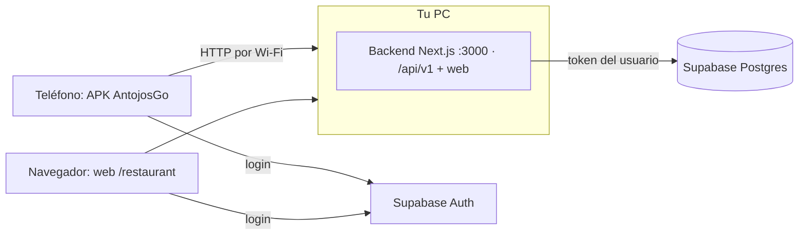

# Guía: levantar AntojosGo y probar la web y el APK en un teléfono

Última revisión: 2 de octubre de 2026. Esta guía describe el estado actual: todo funciona en tu PC y en tu red Wi-Fi. Todavía no hay servidor en internet.

## 1. Cómo encajan las piezas



- **Backend + web** (carpeta raíz): un solo servidor Next.js en el puerto **3000**. Sirve la API `/api/v1` y la web del restaurante en `/restaurant`.
- **App móvil** (carpeta `mobile/`): Expo / React Native. Inicia sesión directamente con Supabase y todo lo demás lo pide al backend.
- **Base de datos**: Supabase (proyecto `dmskwpquomqcsumaqaej`). Los cambios de esquema están en `supabase/migrations/`.

**Consecuencia importante:** mientras no haya hosting, el APK y la web solo funcionan si **tu PC está encendida, con el backend en marcha y en la misma Wi-Fi que el teléfono**.

## 2. Preparación (una sola vez)

### 2.1 Programas necesarios

| Programa | Para qué | Cómo comprobarlo |
|---|---|---|
| Node.js 22 | Backend, web y herramientas de Expo | `node --version` |
| JDK 17 (Eclipse Adoptium) | Compilar el APK | `java -version` |
| Android SDK (Android Studio) | Compilar el APK y el emulador | existe `%LOCALAPPDATA%\Android\Sdk` |
| ninja 1.12.1 | Compilar código nativo con rutas largas en Windows | `& "$env:LOCALAPPDATA\Programs\ninja-1.12.1\ninja.exe" --version` |

Si falta ninja, descárgalo de la página oficial de versiones de ninja-build (archivo `ninja-win.zip` de la versión 1.12.1) y descomprímelo en `%LOCALAPPDATA%\Programs\ninja-1.12.1\`.

Las **rutas largas de Windows** deben estar activadas (ya lo están en esta PC). Para comprobarlo:
```powershell
(Get-ItemProperty 'HKLM:\SYSTEM\CurrentControlSet\Control\FileSystem').LongPathsEnabled   # debe dar 1
```

### 2.2 Espacio en disco

Compilar el APK necesita **al menos 15 GB libres**: Gradle, el NDK y los archivos intermedios ocupan varios GB. Con menos espacio la compilación falla con `No space left on device` y Windows puede volverse inestable.
```powershell
Get-PSDrive C | % { [math]::Round($_.Free/1GB,1) }   # GB libres
```

### 2.3 Variables de entorno (archivos `.env.local`)

No se suben a git y **no deben compartirse ni pegarse en chats**. Solo se indican los nombres:

| Archivo | Variables |
|---|---|
| `.env.local` (raíz) | `NEXT_PUBLIC_SUPABASE_URL`, `NEXT_PUBLIC_SUPABASE_PUBLISHABLE_KEY` |
| `mobile/.env.local` | `EXPO_PUBLIC_SUPABASE_URL`, `EXPO_PUBLIC_SUPABASE_ANON_KEY`, `EXPO_PUBLIC_API_URL=http://10.0.2.2:3000` (para el emulador) |

`SUPABASE_DB_URL` (con la contraseña de la base) **no la necesita la app**. Si la añadiste, bórrala del archivo cuando no la uses.

### 2.4 IP fija de la PC en tu Wi-Fi

El APK lleva escrita la dirección del backend (por ejemplo `http://192.168.1.19:3000`). Si el router le da otra IP a tu PC, el APK deja de conectar y hay que recompilarlo. Para evitarlo:
1. Consulta tu IP actual:
   ```powershell
   Get-NetIPAddress -AddressFamily IPv4 -InterfaceAlias Wi-Fi | Select IPAddress
   ```
2. En la configuración del router, reserva esa IP para tu PC ("DHCP reservation" o "IP estática").

### 2.5 Abrir el puerto 3000 en el firewall (solo red local)

Tu Wi-Fi está marcada como red **Pública**, así que Windows bloquea las conexiones del teléfono. En **PowerShell como administrador**:
```powershell
New-NetFirewallRule -DisplayName "AntojosGo dev (3000)" -Direction Inbound -Protocol TCP -LocalPort 3000 -RemoteAddress LocalSubnet -Action Allow -Profile Any
```
- `LocalSubnet` limita el acceso a dispositivos de tu misma red, no de internet.
- Para quitarla cuando termines:
  ```powershell
  Remove-NetFirewallRule -DisplayName "AntojosGo dev (3000)"
  ```

## 3. Arrancar el backend y la web

1. Abre una terminal en la carpeta del proyecto:
   ```powershell
   cd C:\Users\pablo\Documents\AntojosGo
   npm.cmd run dev
   ```
2. Espera a ver `Ready in …`. **Deja esta terminal abierta**: si la cierras, el backend se detiene.
3. Comprueba en el navegador de la PC:
   - API: `http://localhost:3000/api/v1/catalog/search?q=a` debe mostrar un JSON con `"items"`.
   - Web del restaurante: `http://localhost:3000/restaurant`.

> `npm run dev` compila cada página la primera vez que se visita, así que la primera carga tarda unos segundos. Es normal en modo desarrollo.

### 3.1 Usar la web del restaurante

1. En `/restaurant`, inicia sesión o crea una cuenta.
2. **Registrar restaurante** → aparece en "Mis restaurantes".
3. **Editar perfil**: nombre y descripción.
4. **Sedes**:
   1. Añade una sede (nombre, departamento, municipio, dirección). Queda como **Borrador privado**.
   2. **Seleccionar ubicación**: haz clic en el mapa o escribe las coordenadas → **Confirmar y guardar ubicación**.
   3. **Publicar sede**: solo se habilita con la ubicación guardada. A partir de ahí los clientes la ven en la búsqueda.
5. **Menú**:
   1. Agrega platillos con nombre y precio (acepta `35,50`); categoría y descripción son opcionales. Se crean **ocultos**.
   2. **Mostrar** los hace visibles en todas las sedes publicadas.
   3. **Marcar agotado** los mantiene visibles pero marcados como "Agotado".
   4. **Eliminar** pide confirmación y no se puede deshacer.

## 4. Probar la web desde el teléfono

1. Conecta el teléfono a **la misma Wi-Fi** que la PC.
2. Con el backend en marcha (paso 3), abre en el navegador del teléfono: `http://<IP-de-tu-PC>:3000/restaurant` (por ejemplo `http://192.168.1.19:3000/restaurant`).
3. Si carga la pantalla de acceso, la red y el firewall están bien y el APK también podrá conectar.
4. Si no carga, revisa la [sección 8](#8-solución-de-problemas).

## 5. Instalar el APK en el teléfono

APK actual (solo para teléfonos ARM64, que son casi todos los actuales):
```
C:\Users\pablo\Documents\AntojosGo\mobile\android\app\build\outputs\apk\release\app-release.apk
```
Apunta a `http://192.168.1.19:3000`. Si tu IP cambió, recompílalo (sección 6).

1. Copia el archivo al teléfono por cable USB, Google Drive o correo a ti mismo.
2. Ábrelo en el teléfono. Android pedirá permitir **instalar apps de origen desconocido** para la app con la que lo abriste (Archivos, Drive…). Acéptalo solo para esa app.
3. Abre **AntojosGo** con el backend en marcha en la PC.
4. Recorrido sugerido:
   1. Crear cuenta o iniciar sesión.
   2. "Mis restaurantes" → negocio → menú y sedes.
   3. Publicar una sede.
   4. "Buscar antojos" → buscar un platillo → **Ver sede** → ver el menú.

Limitaciones de esta build:
- **Sin mapa**, porque no tiene clave de Google Maps. La búsqueda muestra la lista y la ubicación de una sede se guarda con **Usar mi ubicación actual** (GPS). La web sí tiene mapa.
- **HTTP sin cifrar**: solo es válido dentro de tu red para pruebas.

### 5.1 Cuentas de prueba

Existen dos cuentas QA en Supabase: `pabloruiz0123+qa1002@gmail.com`, dueña de "QA Antojos Cocina", y `pabloruiz0123+qa1002b@gmail.com`, sin negocios y usada para comprobar el aislamiento. Las contraseñas **no se guardan en el repositorio**. Si las perdiste, crea cuentas nuevas desde la app.

## 6. Recompilar el APK

Recompila cuando cambie el código de la app, cuando cambie la IP de la PC o cuando quieras añadir la clave de mapas. Necesitas **15 GB libres**.

En una terminal **nueva** de PowerShell:
```powershell
cd C:\Users\pablo\Documents\AntojosGo\mobile

$env:ANDROID_HOME = "$env:LOCALAPPDATA\Android\Sdk"
$env:EXPO_PUBLIC_API_URL = 'http://192.168.1.19:3000'   # tu IP actual
$env:ALLOW_HTTP_API = '1'                                # permite HTTP: solo builds locales
$env:NINJA_PATH = "$env:LOCALAPPDATA\Programs\ninja-1.12.1\ninja.exe"
$env:NODE_ENV = 'production'
# Opcional, para tener mapa: clave restringida a com.antojosgo.mobile
# $env:GOOGLE_MAPS_ANDROID_KEY = '...'

npx expo prebuild --platform android --no-install
cd android
.\gradlew.bat assembleRelease -PreactNativeArchitectures=arm64-v8a
```
- Tarda entre 6 y 15 minutos y termina con `BUILD SUCCESSFUL`.
- El resultado queda en `mobile\android\app\build\outputs\apk\release\app-release.apk`.
- **Para probarlo también en el emulador** usa `-PreactNativeArchitectures=arm64-v8a,x86_64`: el APK pesa más y ocupa más disco al compilar. Un APK solo ARM64 se instala en el emulador x86_64, pero se cierra al abrirlo.
- Si el teléfono ya tenía la app, instala encima; no hace falta desinstalar.

Qué hace cada variable (definidas en `mobile/app.config.js`):

| Variable | Efecto |
|---|---|
| `EXPO_PUBLIC_API_URL` | Dirección del backend que queda grabada en el APK |
| `ALLOW_HTTP_API=1` | Permite HTTP sin cifrar. No usar en producción |
| `NINJA_PATH` | Usa ninja 1.12 para las rutas largas (plugin `mobile/plugins/with-ninja-path.js`) |
| `GOOGLE_MAPS_ANDROID_KEY` | Activa el mapa. Sin ella el mapa se oculta, porque si no la app se cerraría |

## 7. Desarrollo diario con el emulador (Expo Go)

Para cambiar código y verlo al instante, sin compilar APK:
1. Backend: `npm.cmd run dev` (sección 3).
2. Abre el emulador `Medium_Phone_API_36.1` desde Android Studio, o:
   ```powershell
   & "$env:LOCALAPPDATA\Android\Sdk\emulator\emulator.exe" -avd Medium_Phone_API_36.1
   ```
3. En otra terminal:
   ```powershell
   npm.cmd run mobile:background
   ```
   Arranca Metro sin duplicarlo y conecta los puertos 8081 y 3000 del emulador con la PC.
4. Abre la app en Expo Go: `exp://127.0.0.1:8081`.
5. Al guardar un archivo, la app se recarga sola.

En el emulador la app usa `http://10.0.2.2:3000`, que es la dirección de la PC vista desde el emulador.

## 8. Solución de problemas

| Síntoma | Causa probable | Solución |
|---|---|---|
| El teléfono no abre `http://IP:3000` | Firewall, otra Wi-Fi, backend apagado o IP cambiada | Comprueba el paso 2.5, la misma Wi-Fi, `npm.cmd run dev` abierto y la IP con el comando de 2.4 |
| La app dice "No pudimos conectar con el servidor" | Las mismas causas que la fila anterior | Prueba primero la web desde el teléfono (sección 4) |
| La app se cierra al abrirla en el emulador | APK solo ARM64 en un emulador x86_64 | Compila con `arm64-v8a,x86_64` o prueba en un teléfono real |
| `No space left on device` al compilar | Disco lleno | Libera espacio (mínimo 15 GB) y compila solo `arm64-v8a` |
| `ninja: error: Stat(...)` | Rutas de más de 260 caracteres | Define `NINJA_PATH` y repite `prebuild` |
| `generateCodegenSchemaFromJavaScript` falla | Copia antigua de `@react-native/codegen` dentro de `mobile/node_modules/react-native/node_modules` | Ya está renombrada a `codegen.stale-0.81.5`. Si reinstalas dependencias y vuelve a aparecer, renómbrala igual |
| `this and base files have different roots` | Compilar desde una unidad `subst` | No uses `subst`; compila desde `C:\Users\...` con `NINJA_PATH` |
| El mapa se ve gris en Expo Go | La clave de Maps de Expo Go no está autorizada | Normal en Expo Go; usa la web o un APK con clave propia |
| La web o la API devuelven `503` | Variables de Supabase ausentes en `.env.local` | Revisa la sección 2.3 y reinicia `npm.cmd run dev` |
| El backend deja de responder sin motivo | Se cerró la terminal de `npm.cmd run dev` | Vuelve a arrancarlo |

## 9. Comprobaciones antes de dar algo por terminado

En la raíz del proyecto:
```powershell
npm.cmd test                  # pruebas unitarias
npm.cmd run typecheck         # tipos del backend y la web
npm.cmd run mobile:typecheck  # tipos de la app
```
Prueba de integración de la API con dos cuentas reales. Necesita el backend en marcha y que la cuenta A tenga un restaurante:
```powershell
$env:API_URL='http://127.0.0.1:3000'
$env:QA_A_EMAIL='...'; $env:QA_A_PASSWORD='...'
$env:QA_B_EMAIL='...'; $env:QA_B_PASSWORD='...'
npm.cmd run test:api          # 18 comprobaciones; crea y borra un platillo temporal
```
Úsala contra una base de **pruebas** cuando exista una; hoy solo hay un proyecto Supabase.

## 10. Cambios en la base de datos

1. Escribe la migración en `supabase/migrations/<AAAAMMDDHHMMSS>_<nombre>.sql`. Es obligatorio guardar cada cambio ahí.
2. Aplícala de una de estas formas:
   - **SQL Editor de Supabase** → New query → pega el archivo → Run. Funciona siempre.
   - **Claude con el MCP de Supabase**: funciona si la migración no tiene `DROP` u otras operaciones destructivas; esas piden una confirmación que la sesión de VS Code no puede mostrar.
3. Después revisa *Advisors → Security* en el panel de Supabase.

## 11. Seguridad durante las pruebas

- No compartas `.env.local` ni pegues claves o contraseñas en chats. Si alguna se expuso, **rótala** en Supabase (API Keys o Database → Reset password).
- El APK de prueba usa HTTP y la regla de firewall abre el puerto 3000 en tu red local: **quita la regla** cuando no estés probando.
- Las cuentas y datos QA están en la misma base que se usaría en producción. Antes de un piloto hay que separar entornos (ver [PLAN-BACKEND-WEB.md](PLAN-BACKEND-WEB.md), sección 4).
- Medidas pendientes antes de usuarios reales: confirmación de correo, protección contra contraseñas filtradas, límites de peticiones, HTTPS y respaldos. Están detalladas en el plan.

## 12. Pendientes y decisiones abiertas

1. **Borrar el código heredado** que ya no se usa. La lista está en [PLAN-BACKEND-WEB.md](PLAN-BACKEND-WEB.md), sección 7.
2. **Clave de Google Maps** para el mapa del APK.
3. **Hosting con HTTPS** (por ejemplo Vercel) y un segundo proyecto Supabase para pruebas, para que el APK funcione sin tu PC.
4. **Fotos** de platillos y sedes (Fase 5 del plan).

## 13. Pruebas con servidor en internet (Vercel) y APK de prueba

Planes verificados el 6 de octubre de 2026:

- **Vercel Hobby:** gratis, solo para uso personal y no comercial. Incluye 1 M de invocaciones de funciones, 4 h de CPU activa y 100 GB de transferencia al mes. Al llegar al límite no se puede comprar más: hay que pasar a Pro.
- **Supabase Free:** 2 proyectos, 500 MB de base de datos y 1 GB de archivos. El proyecto se pausa tras 1 semana sin actividad.

**Desplegar (una vez):**

1. Entra en vercel.com con GitHub → *Add New → Project* → importa `Pandre2425/AntojosGo` (rama `main`). El framework se detecta solo.
2. En *Environment Variables* agrega `NEXT_PUBLIC_SUPABASE_URL` y `NEXT_PUBLIC_SUPABASE_PUBLISHABLE_KEY`, con los mismos valores de `.env.local`. **Nunca** agregues la clave `sb_secret_…` ni `SUPABASE_DB_URL`: la app no las usa.
3. *Deploy*. Después, cada push a `main` despliega solo.
4. Comprueba que responde: `https://<proyecto>.vercel.app/api/v1/catalog/search?limit=1` devuelve JSON con `items`.

**APK contra el servidor:**

```powershell
.\scripts\build-apk.ps1 -ApiUrl https://<proyecto>.vercel.app
```

El script comprueba primero que el backend responde. El APK resultante solo permite HTTPS y no muestra el selector de servidor.

**Repartir el APK:** pasa el archivo `app-release.apk` (por Drive o WhatsApp) o usa Firebase App Distribution, que es gratis y no pide tarjeta. En el teléfono hay que permitir «instalar apps desconocidas».

**Firma del APK.** El APK se firma con la clave propia del proyecto (SHA-1 `21:35:7A:F7:21:3C:67:D2:9C:FC:7C:D5:72:0B:A4:DE:01:9D:C6:D6`), nunca con la clave pública de depuración de React Native. Las actualizaciones solo se instalan encima si llevan esta misma firma.

- La clave está en `C:\Users\pablo\.antojosgo\antojosgo-release.jks`, y su contraseña en el bloque `ANTOJOSGO_RELEASE_*` de `C:\Users\pablo\.gradle\gradle.properties`. Ninguno de los dos está en git.
- **Guarda una copia de ambos** en un lugar seguro, fuera de esta computadora. Si se pierden, no se pueden publicar actualizaciones: todos tendrían que desinstalar y reinstalar.
- Para compilar en otra computadora, copia los dos archivos a las mismas rutas.
- `scripts/build-apk.ps1` se niega a compilar sin la clave, y al terminar verifica con `apksigner` que el APK no quedó firmado con la clave de depuración.

**Publicar una actualización del APK** (la app avisa al abrirse):

1. Sube en 1 `android.versionCode` en `mobile/app.json` y ajusta `version` (por ejemplo, 2 y `0.2.0`).
2. Compila: `.\scripts\build-apk.ps1 -ApiUrl https://<proyecto>.vercel.app`.
3. En GitHub, ve a *Releases → Draft a new release*, crea la etiqueta `v0.2.0` y adjunta `app-release.apk`.
4. Actualiza `public/app-version.json` con el mismo `versionCode`, `version` y unas notas, y haz push. Al desplegarse, las apps instaladas muestran «Nueva versión» con un botón que abre la página de Releases.

La app solo abre enlaces que empiecen por `https://github.com/Pandre2425/AntojosGo/releases/`, aunque el servidor devuelva otro. Android solo instala la actualización encima de la anterior si está firmada con la misma clave.
