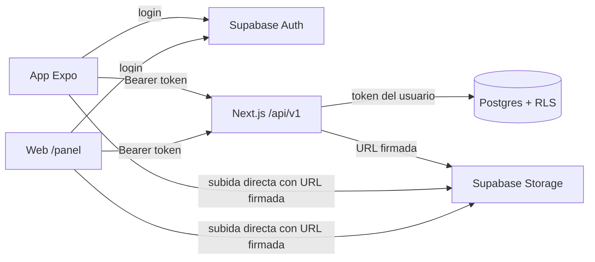

# Plan: backend único, app móvil y web para restaurantes

Fecha: 2 de octubre de 2026. Complementa [ESTADO-INTEGRAL-2026-10-02.md](ESTADO-INTEGRAL-2026-10-02.md) y [EXECUTION-PLAN.md](EXECUTION-PLAN.md). Procedimiento práctico para levantar y probar todo: [GUIA-WEB-Y-APK.md](GUIA-WEB-Y-APK.md).

## 1. Decisiones tomadas

| Tema | Decisión |
|---|---|
| Backend | Rutas de API de **Next.js** del proyecto actual, versionadas en `/api/v1`. Express queda descartado mientras no haya una necesidad concreta (conexiones persistentes o procesos largos). |
| Web del restaurante | Páginas en el **mismo proyecto Next.js** (`/panel`), consumiendo la **misma API** que el móvil. |
| Identidad | Supabase Auth sin cambios. El login ocurre en el cliente (móvil o web); el resto de operaciones van al backend con `Authorization: Bearer <token>`. |
| Base de datos | Supabase Postgres sin cambios de modelo. RLS y funciones `SECURITY DEFINER` actuales se mantienen como **segunda barrera**. |
| Publicación | El dueño publica directamente, sin aprobación (decisión del 2 de octubre). |
| Migración | Por módulo. Al pasar un módulo al backend se elimina su acceso directo desde el cliente: nunca conviven dos caminos. |

## 2. Arquitectura destino



Reglas de diseño:

1. **El backend actúa con el token del usuario**, nunca con la clave secreta, salvo en tareas administrativas explícitas y auditadas. Si una ruta tiene un error de autorización, RLS sigue impidiendo leer o modificar datos ajenos.
2. **Un contrato por operación** en `shared/contracts` (zod), validado en el servidor y reutilizado por móvil y web.
3. **Respuestas agregadas** para reducir viajes de red: por ejemplo, el detalle público devuelve sede y menú en una sola respuesta.
4. **Formato de error único**: `{ error: { code, message }, requestId }`. Los mensajes son para el usuario y nunca incluyen detalles de Postgres.

## 3. Fases

Cada fase termina con pruebas automáticas, typecheck, prueba manual en emulador o navegador y una nota en el documento de estado.

### Fase 0 — Cimientos del backend (tamaño: medio)

1. **Cliente Supabase por petición.** Los adaptadores de `modules/` hoy toman un cliente global (`getSupabase()`). Deben recibir el cliente como parámetro, igual que ya hace `modules/catalog`. El móvil y las pruebas siguen funcionando, porque solo cambia quién crea el cliente.
2. **Middleware de autenticación común** (`lib/server/auth.ts`): extrae el Bearer, verifica el JWT **localmente con JWKS** (`SUPABASE_JWKS_URL`, sin una llamada de red por petición, que es la mejora de fluidez más importante del backend) y crea el cliente con ese token. Sustituye la lógica repetida de `restaurant-access.ts`.
3. **Utilidades de respuesta**: errores uniformes, `requestId` por petición, límite de tamaño del cuerpo y validación zod obligatoria.
4. **Retirar la API heredada**, que hoy no funciona o es engañosa: `/api/restaurants/login` y `/register` (410), `/dishes`, `/menu` y `/profile` (usan un cliente sin token y ya fallan por los permisos nuevos de `foods`), `/images` (guarda un placeholder) y `/analytics`. Se reemplazan por `/api/v1`.

Aceptación: pruebas unitarias del middleware (token ausente, inválido, expirado y válido) y del formato de error.

### Fase 1 — API v1 de restaurantes (tamaño: medio)

| Método y ruta | Operación | Notas |
|---|---|---|
| `GET /api/v1/me/restaurants` | Mis negocios | Paginado por cursor; hoy el límite de 50 no tiene continuación |
| `POST /api/v1/restaurants` | Crear negocio | Idempotente por nombre, como hoy |
| `PATCH /api/v1/restaurants/:id` | Nombre y descripción | |
| `GET /api/v1/restaurants/:id/branches` | Sedes | Paginado |
| `POST /api/v1/restaurants/:id/branches` | Crear sede | Exige cabecera `Idempotency-Key` (hoy se usa un UUID estable) |
| `PATCH /api/v1/branches/:id` | Datos de la sede | Nuevo: hoy solo se edita la ubicación |
| `PUT /api/v1/branches/:id/location` | Ubicación | |
| `POST /api/v1/branches/:id/publish` · `/unpublish` | Publicación | Llama a `set_branch_published` |
| `GET/POST /api/v1/restaurants/:id/dishes` | Menú del dueño | |
| `PATCH/DELETE /api/v1/dishes/:id` | Editar o borrar platillo | |

Aceptación: una prueba de integración automatizada con **dos cuentas y sin sesión** que repita las comprobaciones hechas a mano el 2 de octubre (lectura, escritura, borrado e inserción ajenas; mover un platillo de negocio; precio inválido). Debe ejecutarse contra una base de pruebas, no la de producción.

### Fase 2 — App móvil contra la API (tamaño: pequeño-medio)

1. Cliente HTTP único en `mobile/src/api.ts`, ampliando `catalog-api.ts`: añade el token, aplica tiempo límite, cancela peticiones obsoletas, reintenta solo las lecturas y renueva la sesión ante un 401.
2. Migrar pantallas en este orden: negocios → sedes y ubicación → publicar → menú.
3. Eliminar del móvil los imports de `modules/restaurants`. Al final, el móvil solo usa Supabase para el login.
4. Mejoras de fluidez en la app: caché en memoria de la última respuesta por pantalla con revalidación al volver (sin dependencia nueva) y `FlatList` en las listas que puedan crecer.

Aceptación: el recorrido completo en el emulador (registro → negocio → sede → ubicación → menú → publicar → búsqueda → detalle) funciona sin llamadas directas a tablas. Se comprueba buscando `from('` en `mobile/`.

### Fase 3 — API pública del comensal (tamaño: pequeño)

1. `GET /api/v1/catalog/search` (las rutas actuales pasan a v1) y `GET /api/v1/branches/:id/public`, que devuelve sede y menú en una sola respuesta.
2. Caché HTTP de las respuestas públicas (`Cache-Control: public, s-maxage=60, stale-while-revalidate=300`). Nunca se cachean respuestas autenticadas.
3. El detalle del móvil deja de llamar a Supabase directamente. Esto cierra el fallo F09 (lectura pública dividida).

### Fase 4 — Web del restaurante `/panel` (tamaño: grande)

1. Login y registro con Supabase Auth en el navegador. La web guarda la sesión y llama a `/api/v1` con Bearer, igual que el móvil, para tener un solo modelo de seguridad.
2. Páginas: mis negocios, perfil, sedes (alta, edición, publicar), ubicación con mapa y menú (tabla editable, ocultar o mostrar, agotado).
3. Mapa web con **Leaflet + OpenStreetMap**: gratis, sin clave, y permite elegir el punto con clic o arrastrando el marcador. También se añade la entrada manual de coordenadas, por accesibilidad.
4. Diseño adaptable a tableta, porque muchos restaurantes trabajarán desde la caja o la cocina.
5. Retirar la interfaz web heredada con datos simulados (F08: `components/ai-chat-interface.tsx`, `favorites-list.tsx`, modo demo) o aislarla fuera del recorrido productivo.

Aceptación: el mismo recorrido del dueño completado en el navegador, y los cambios hechos en la web visibles al instante en el móvil y viceversa.

### Fase 5 — Fotos reales (tamaño: medio)

1. Bucket de Supabase Storage con políticas por dueño.
2. Subida en dos pasos: `POST /api/v1/uploads` valida permiso, tipo y tamaño declarados y devuelve una **URL firmada** de corta duración; el cliente sube directamente a Storage, sin pasar el archivo por el backend.
3. Validación en servidor tras la subida: tipo real por contenido (no por extensión), tamaño máximo de 5 MB, dimensiones y nombres aleatorios. Variantes redimensionadas con la transformación de imágenes de Supabase.
4. Elimina el éxito ficticio de la ruta actual (F06).

### Fase 6 — Despliegue y entornos (tamaño: pequeño, requiere decisiones)

1. **Dos proyectos Supabase**: desarrollo/pruebas y producción, con datos y claves separados. Las pruebas de carga y de integración nunca tocan producción.
2. Backend y web en Vercel u otro hosting de Next.js con HTTPS. El móvil apunta a esa URL mediante `EXPO_PUBLIC_API_URL`.
3. Sincronizar el historial de migraciones local y remoto antes de usar `supabase db push` (hay 4 migraciones remotas sin archivo local).
4. Build de desarrollo o APK con la clave de mapas que se elija.

## 4. Seguridad

Las medidas marcadas **[ahora]** forman parte de las fases anteriores. Las marcadas **[antes de usuarios reales]** son el endurecimiento diferido de la sección 4 de EXECUTION-PLAN y deben quedar hechas antes de abrir a restaurantes o comensales reales.

### 4.1 Identidad y sesiones
- **[ahora]** Verificación del JWT en cada petición: firma por JWKS, expiración, `aud = authenticated` y emisor del proyecto. Nunca confiar en un `user_id` enviado por el cliente.
- **[ahora]** Tokens solo en cabecera `Authorization`, no en la URL. En el móvil, SecureStore (como hoy); en la web, almacenamiento de la sesión de Supabase y renovación automática.
- **[antes de usuarios reales]** Confirmación de correo obligatoria, recuperación de contraseña con enlaces verificados, protección contra contraseñas filtradas y longitud mínima de 10 caracteres.
- **[antes de usuarios reales]** Cierre de sesión en todos los dispositivos y eliminación de cuenta con borrado o anonimización de datos.

### 4.2 Autorización
- **[ahora]** Doble barrera: comprobación explícita de propiedad en el backend **y** RLS en la base. Las pruebas de la Fase 1 deben fallar si se quita cualquiera de las dos.
- **[ahora]** Columnas sensibles no modificables desde el cliente (`restaurant_id`, `status` de la sede, `auth_owner_id`), como ya ocurre por permisos de columna.
- **[ahora]** El estado `inactive` (suspensión) solo lo cambia un administrador. Requiere una tabla de roles (`app_admins`) consultada por una función, nunca un correo escrito en el código.
- **[antes de usuarios reales]** Varios administradores por restaurante (miembros con rol), con invitación y revocación auditadas.

### 4.3 Entrada y salida
- **[ahora]** Validación zod de todo cuerpo, parámetro y query en el servidor, con límites de longitud y cuerpo máximo de 100 KB (salvo subidas, que no pasan por la API).
- **[ahora]** IDs como UUID validados; paginación con límite máximo.
- **[ahora]** Errores genéricos al cliente y detalle solo en los registros del servidor (ya aplicado en el catálogo).
- **[ahora]** Consultas solo mediante el SDK o funciones con parámetros. Prohibido construir SQL concatenando texto.

### 4.4 Web
- **[ahora]** Cabeceras: `Content-Security-Policy` (sin `unsafe-eval`; teselas de OSM y dominios de Supabase permitidos), `Strict-Transport-Security`, `X-Content-Type-Options: nosniff`, `Referrer-Policy: strict-origin-when-cross-origin` y `frame-ancestors 'none'`.
- **[ahora]** CORS cerrado: la web es del mismo origen y el móvil no necesita CORS, así que no se añade `Access-Control-Allow-Origin` abierto.
- **[ahora]** Al usar Bearer en cabecera y no cookies, la API no es vulnerable a CSRF. Si en el futuro se usan cookies de sesión, añadir `SameSite=Lax` y verificación de `Origin`.
- **[ahora]** Escapar todo contenido de usuario (React lo hace). Prohibido `dangerouslySetInnerHTML` con datos de restaurantes.

### 4.5 Abuso y disponibilidad
- **[antes de usuarios reales]** Límite de peticiones por IP y por usuario en rutas de escritura, búsqueda y subida. Requiere un almacén compartido (por ejemplo Upstash Redis o la función de límites del hosting); un contador en memoria no sirve en servidores sin estado.
- **[antes de usuarios reales]** Límites de Auth en Supabase (registros y correos por hora) y CAPTCHA en el registro si aparece abuso.
- **[ahora]** Tiempo límite en todas las llamadas salientes (ya existe `createBoundedFetch`).

### 4.6 Secretos y configuración
- **[ahora]** Nunca poner la clave secreta (`sb_secret_…`) ni la contraseña de la base en variables `NEXT_PUBLIC_*` o `EXPO_PUBLIC_*`, ni en el repositorio. Solo variables de entorno del servidor.
- **[ahora]** Retirar `SUPABASE_DB_URL` de `.env.local` cuando no se use; no la necesita la app.
- **[antes de usuarios reales]** Rotar la clave secreta y la contraseña de la base que se manejaron durante el desarrollo; claves distintas por entorno.
- **[ahora]** Unificar nombres de variables: el servidor ya acepta `PUBLISHABLE_KEY`, mientras que el móvil usa `EXPO_PUBLIC_SUPABASE_ANON_KEY`.

### 4.7 Archivos subidos
- Tipo real por contenido, tamaño máximo, re-codificación o eliminación de metadatos EXIF (que pueden contener la ubicación GPS de quien tomó la foto), nombres aleatorios, bucket sin listado público y URLs firmadas de corta duración para subir.

### 4.8 Registros, auditoría y recuperación
- **[ahora]** `requestId` en cada respuesta y registro. Nunca registrar tokens, contraseñas, correos completos ni coordenadas de usuarios.
- **[antes de usuarios reales]** Tabla de auditoría para acciones sensibles: publicar o despublicar, borrar platillos, cambios de miembros y suspensiones.
- **[antes de usuarios reales]** Respaldos automáticos con un ensayo de restauración documentado. Alertas de errores 5xx y de latencia.

### 4.9 Base de datos y dependencias
- **[antes de usuarios reales]** Mover PostGIS fuera de `public` (asesor de Supabase) y revisar de nuevo los asesores tras cada migración.
- **[ahora]** Fijar versiones (`bcryptjs: latest` en la raíz) y ejecutar `npm audit` en cada fase; Dependabot o Renovate cuando haya repositorio remoto.

## 5. Mejoras detectadas fuera del backend

| Mejora | Por qué | Esfuerzo |
|---|---|---|
| Decidir el proveedor de mapas del móvil | El mapa sale gris en Expo Go (`Authorization failure`). La web usará OSM; en el móvil se puede usar Google con clave propia o MapLibre/OSM | Decisión + build de desarrollo |
| Indicar "coincide con: Pepián" en los resultados | Explica por qué aparece un restaurante. Requiere recrear la función de búsqueda desde el SQL Editor | Pequeño |
| Índice de texto (`pg_trgm`) en la búsqueda | Hoy se quitan los acentos fila por fila; es suficiente hasta unos miles de sedes | Pequeño |
| Indicar que la distancia es "en línea recta" | Evita confundirla con distancia o tiempo por carretera | Mínimo |
| Edición completa de sede y horarios | Hoy solo se edita la ubicación; los horarios no existen | Medio |
| Pruebas de integración automáticas con dos cuentas | Convertir en script las comprobaciones manuales de RLS | Pequeño |
| Eliminar `AllCode.txt` (volcado de código de ~940 KB versionado en git) y el proyecto Capacitor `android/` heredado | Confunden búsquedas, revisiones y agentes; el cliente vigente es `mobile/` | Mínimo, confirmar antes |
| Favoritos, exclusiones y "Sorpréndeme" persistentes | Etapa 5 del plan, ya sobre la API | Medio |

## 6. Orden recomendado y seguimiento

1. Fase 0 → Fase 1 → Fase 2: la app queda completa contra el backend.
2. Fase 3: el comensal queda contra el backend y con caché.
3. Fase 4: web del restaurante.
4. Fase 5: fotos.
5. Fase 6 y las medidas **[antes de usuarios reales]**: piloto.

Las fases 4 y 5 pueden adelantarse si conviene mostrar la web antes, pero siempre después de las fases 0 y 1, porque la web depende de la API.

Cada entrega registra en el documento de estado: qué cambió, las migraciones aplicadas, las pruebas ejecutadas, las limitaciones y la siguiente condición de aceptación.

## 7. Avance (2 de octubre de 2026)

| Fase | Estado | Notas |
|---|---|---|
| 0 | Hecha, salvo la limpieza | `lib/server/api.ts` (`route`, `readJson`, errores con `requestId`, verificación del JWT con `getClaims`), `lib/app-error.ts`, adaptadores con cliente por petición. **Pendiente de autorización del usuario:** borrar la API y los componentes heredados (`app/api/restaurants`, `app/api/catalog`, `lib/server/{menu-management,restaurant-*}.ts`, `lib/{http,demo-restaurant,menu-management,restaurant-*}.ts`, `components/{restaurant-dashboard,restaurant-login,restaurant-registration,menu-management,dish-form,restaurant-profile-editor}.tsx`, `tests/services.test.cjs` y el caso demo de `tests/demo.test.cjs`). Nada los importa. |
| 1 | Hecha | 12 rutas en `app/api/v1`. `npm run test:api` (18 comprobaciones con dos cuentas y sin sesión) aprobado. |
| 2 | Hecha | Cliente compartido `lib/api-client.ts` (móvil `mobile/src/api.ts`, web `lib/web-api.ts`). El móvil solo usa Supabase para Auth. Recorrido verificado en el emulador. |
| 3 | Hecha | `GET /api/v1/catalog/search` y `GET /api/v1/branches/:id/public` (sede + menú) con `Cache-Control` público. |
| 4 | Hecha (sobre `/restaurant`, no `/panel`) | Se reutilizó la web existente con mapa Leaflet: perfil, sedes, ubicación, publicar y menú (`components/restaurant-menu.tsx`). Verificada en un navegador sin cabeza: sin errores de consola. |
| 5 | Hecha | Bucket `restaurant-media` y `set_dish_image` (migración `20261003090000_dish_images`). Subida en dos pasos con URL firmada; el servidor verifica el tipo real por bytes. Web y móvil reducen a 1200 px y re-codifican a JPEG (quita EXIF/GPS). Pendiente: borrar `get_public_menu` desde el SQL Editor. |
| 6 | En curso | APK de prueba ARM64 compilado (41 MB, `mobile/android/app/build/outputs/apk/release/app-release.apk`), sin probar aún en un teléfono real. `mobile/app.config.js`: clave de Maps y HTTP local por variables de compilación; sin clave el mapa se oculta. |

### Cómo compilar el APK de prueba (Windows)

```powershell
# Una vez: ninja >= 1.12 (rutas largas) en %LOCALAPPDATA%\Programs\ninja-1.12.1\ninja.exe; LongPathsEnabled=1.
$env:ANDROID_HOME="$env:LOCALAPPDATA\Android\Sdk"
$env:EXPO_PUBLIC_API_URL='http://<IP-LAN-del-PC>:3000'   # HTTPS en producción
$env:ALLOW_HTTP_API='1'                                   # solo builds locales
$env:NINJA_PATH="$env:LOCALAPPDATA\Programs\ninja-1.12.1\ninja.exe"
cd mobile; npx expo prebuild --platform android --no-install
cd android; .\gradlew.bat assembleRelease -PreactNativeArchitectures=arm64-v8a
```

Problemas resueltos al compilar:
- Una copia anidada de `@react-native/codegen` 0.81.5 (resto del SDK 54) rompía el codegen; se renombró a `codegen.stale-0.81.5`.
- Compilar 4 ABIs agotó el disco: usar solo `arm64-v8a` (teléfonos) y añadir `x86_64` solo si se va a probar en el emulador. Un APK solo ARM64 no arranca en el emulador x86_64, porque SoLoader busca en `lib/x86_64`.
- El ninja 1.10 del SDK falla con rutas de más de 260 caracteres: `NINJA_PATH` (plugin `mobile/plugins/with-ninja-path.js`). `subst` no sirve, porque Node resuelve la ruta real.
- Hace falta abrir el puerto 3000 en el firewall de Windows para la red local.

### Avance del 6 de octubre de 2026

- Web del comensal (`/`) conectada a `/api/v1`: búsqueda y detalle con menú y fotos (`components/customer-catalog.tsx`). Se retiraron del recorrido el chat simulado, los favoritos en `localStorage` y las preferencias inventadas (F08, F09).
- Edición de datos de sede en web y móvil (`PATCH /branches/:id`). Subida de fotos desde el móvil (`mobile/src/dish-photo.ts`).
- Cabeceras: CSP (con `'unsafe-inline'` para scripts por los scripts de arranque de Next), HSTS en producción y geolocalización permitida en el propio sitio.
- Móvil: el mapa de búsqueda ya no vuelve a su posición en cada render.
- Verificado: 34 pruebas, typecheck web y móvil, `next build`, navegador sin cabeza en modo producción (0 errores de consola o CSP).

### Avance del 7 de octubre de 2026

- **Comensal sin cuenta en el móvil:** búsqueda y detalle accesibles desde el login («Buscar restaurantes sin cuenta»).
- **Horarios por sede** (`20261007090000_branch_hours`): `opening_hours` jsonb validado por `shared/contracts/hours.ts`; `PUT /branches/:id/hours`; «Abierto ahora» calculado en hora de Guatemala (UTC-6 fija). Editor en web y móvil.
- **Contacto y categoría** (`20261007100000_contact_and_category`): categoría de lista fija por negocio (restricción en la base), teléfono y WhatsApp por sede; la búsqueda también encuentra por categoría. Los campos son opcionales en la API para que un cliente viejo no los borre.
- **Favoritos** (`20261007110000_favorites`, índice en `20261007120000`): tabla con RLS (solo propias, solo sedes publicadas, máx. 200); `GET /me/favorites`, `PUT|DELETE /me/favorites/:branchId`. Pestaña en la web y pantalla en el móvil.
- Datos públicos adicionales en `get_public_branch_extras` (jsonb), ampliable con `CREATE OR REPLACE` sin `DROP`.
- Verificado: 29 pruebas, typecheck web y móvil, `next build`, navegador sin cabeza (0 errores), rutas nuevas devuelven 401 sin sesión, RLS de favoritos simulada con dos usuarios reales dentro de una transacción revertida.

### Avance del 8 de octubre de 2026: asistente del comensal

- **Asistente con reglas primero** (`shared/contracts/assistant.ts`): diccionario de antojos chapines, intenciones (cerca, abierto ahora, barato, otra opción, menú) y seguimiento de la conversación. Las reglas y la IA solo proponen filtros; la búsqueda (`assistant_search`, migración `20261008090000`) decide qué existe y explica qué platillo coincidió.
- **IA de respaldo** con Gemini Flash-Lite (`lib/server/gemini.ts`), opcional mediante `GEMINI_API_KEY` en el servidor. Solo se usa cuando las reglas no entienden, o cuando las palabras desconocidas no dan resultados, y solo se le envía la frase.
- **Interfaz:** `POST /api/v1/assistant`, pantalla de chat en el móvil y pestaña «Para ti» en la web. La caja «¿Qué se te antoja?» de la web también envía la frase al asistente.
- **Etiquetas por platillo** (picante, vegetariano, frío, desayuno…) en los menús de web y móvil.
- **Corrección de fondo:** `createBoundedFetch` decodificaba como Latin-1 en React Native todas las respuestas del servidor con acentos. Además, `build-apk.ps1` ahora siempre vuelve a empaquetar el JavaScript, porque Gradle no vigila `lib/` ni `shared/`.

## 8. Decisiones pendientes del usuario

1. Proveedor de mapas del móvil.
2. Hosting del backend y de la web, y creación de un segundo proyecto Supabase para pruebas.
3. Permitir o no varios administradores por restaurante en el piloto.
4. Confirmar el borrado de `AllCode.txt` y de la carpeta `android/` heredada.
